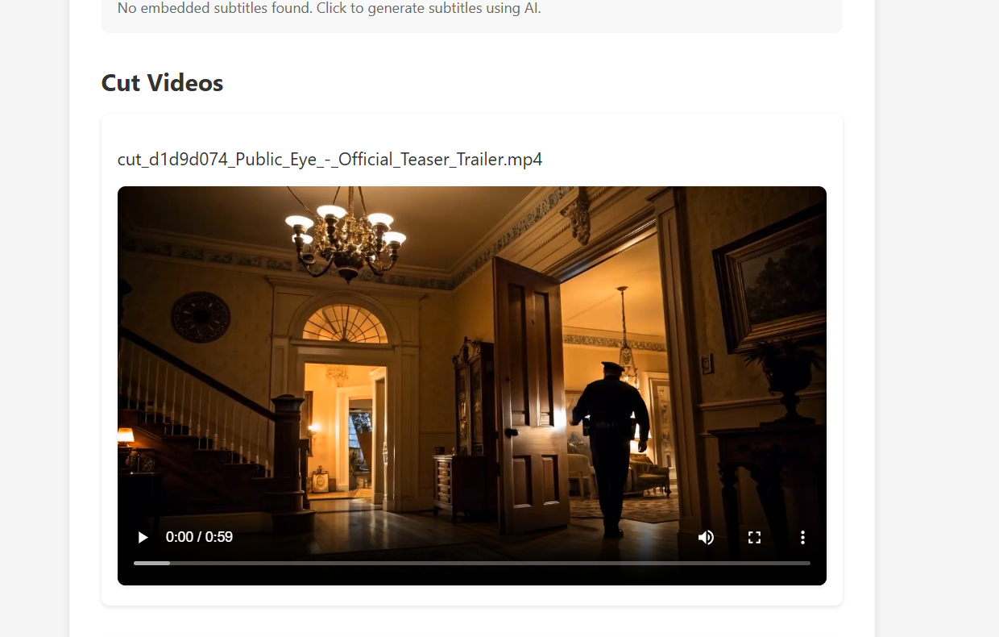

# Movie Shorts

A web application that automatically creates engaging YouTube Shorts from longer videos by analyzing content and extracting the most interesting segments.

## Features

- **Video Upload**: Drag and drop or select video files
- **AI-Powered Analysis**: 
  - Automatically detects engaging sections
  - Analyzes content for humor, emotional impact, and information
  - Suggests multiple sections based on video length
- **Smart Cutting**:
  - Cut videos to specific time ranges
  - Preview cuts before applying
  - Multiple cut suggestions per video
- **Subtitle Support**:
  - Extract embedded subtitles
  - AI-powered transcription using Whisper
  - Subtitle analysis for better content selection
- **Export & Share**:
  - Download cut videos
  - Share directly to social media (Twitter, Facebook, Instagram)
  - Copy shareable links

## Application Workflow

Our application follows a carefully designed step-by-step process to transform long videos into engaging short clips:


### Step-by-Step Process:

1. **Video Upload**
   - Users can upload their video files through a drag-and-drop interface
   - Supports multiple video formats (mp4, avi, mov, mkv, webm)

2. **Initial Analysis**
   - Analyzes video length
   - Provides manual cutting options for user control
   - Prepares video for subtitle processing

3. **Subtitle Processing - Part 1**
   - Extracts existing subtitles from videos that have them embedded
   - Identifies videos requiring subtitle generation

4. **Subtitle Processing - Part 2**
   - Generates subtitles for videos without embedded captions
   - Uses AI-powered Whisper model for accurate transcription

5. **AI Analysis**
   - Processes subtitle timing data
   - Identifies engaging segments based on content
   - Suggests optimal 60-70 second sections for short-form content

6. **Smart Video Cutting**
   - Automatically cuts videos based on AI recommendations
   - Maintains video quality during the cutting process
   - Preserves audio-visual synchronization

7. **Preview and Download**
   - Displays cut video segments for review
   - Enables preview before finalizing
   - Provides download options for processed clips

8. **Social Sharing**
   - Direct sharing to various social media platforms
   - Supports Twitter, Facebook, and Instagram
   - Generates shareable links for easy distribution

9. **Quality Optimization**
   - Compresses videos for optimal file size
   - Maintains quality standards for social media
   - Ensures proper format compatibility

This workflow is designed to make the process of creating short-form content as automated and user-friendly as possible, while still giving users control over the final output.

## Screenshots

### Upload and Processing

*Drag and drop interface for easy video upload*


*Real-time processing status and progress indicators*

### Subtitle Management

*Automatic subtitle extraction and generation*


*AI-powered subtitle analysis for content selection*

### Video Cutting

*Preview interface for video cuts*


*Multiple cut suggestions with previews*

### Export and Sharing

*Easy download and export options*


*Direct sharing to social media platforms*

## Tech Stack

### Frontend
- Next.js 14
- TypeScript
- Tailwind CSS
- React

### Backend
- Python
- Flask
- FFmpeg
- Whisper (OpenAI)
- MoviePy

## Prerequisites

- Node.js 18+ and npm
- Python 3.8+
- FFmpeg (automatically downloaded if not present)

## Installation

1. Clone the repository:
```bash
git clone https://github.com/yourusername/movie-shorts.git
cd movie-shorts
```

2. Install backend dependencies:
```bash
cd backend
pip install -r requirements.txt
```

3. Set up environment variables:
Create a `.env` file in the `backend/app` directory with:
```
GOOGLE_API_KEY=your_google_api_key_here
```

4. Start the backend server:
```bash
cd backend/app
python app.py
```

5. Open the application in your browser:
```
http://localhost:5000
```

## Requirements

- Python 3.8+
- FFmpeg
- Google API Key for Gemini
- Modern web browser with JavaScript enabled

## Project Structure

```
movie-shorts/
├── backend/
│   ├── app/
│   │   ├── static/
│   │   │   └── index.html
│   │   ├── uploads/
│   │   ├── cuts/
│   │   ├── subtitles/
│   │   ├── app.py
│   │   └── .env
│   └── requirements.txt
├── Images/
│   ├── design.png
│   ├── s1.png
│   ├── s2.png
│   ├── s3.png
│   ├── s4.png
│   ├── s5.png
│   ├── s6.png
│   ├── s7.png
│   └── s8.png
└── README.md
```

## Usage

1. Upload a video file
2. Wait for the upload to complete
3. Click "Get Subtitles" to extract or generate subtitles
4. Click "Analyze with AI" to get section suggestions
5. Preview and apply cuts
6. Download or share your cuts

## Contributing

1. Fork the repository
2. Create your feature branch
3. Commit your changes
4. Push to the branch
5. Create a Pull Request

## License

This project is licensed under the MIT License - see the LICENSE file for details.

## Acknowledgments

- OpenAI for Whisper
- FFmpeg team
- MoviePy developers
- Next.js team 
